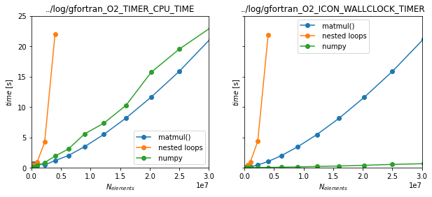

## Matmul benchmark

This is a study on how fast embedded Python in Fortran can be. It compares different matrix multiplication implementations: two implementations using nested loops (in both Fortran and embedded Python) and two implementations that use BLAS libraries (Fortran's intrinsic `matmul()` and Numpy's `np.matmul()`).

### Compilation

During compilation via `make` different options can be specified.

 * Compiler (`FC`): `gfortran` or `ifort`
 * Timer (`TIMER`): `CPU_TIME`, `OMP_WTIME` or `ICON_WALLCLOCK_TIMER`
 * Optimisation (`OPT_LEVEL`): any, e.g. `2`
 * `RUN_SET` will produce a binary that runs a set of tests, instead of receiving a configuration as arguments 

A simple `make` will compile with default settings as configured in the makefile.  

The makefile is made to work on [DKRZ's Mistral cluster](https://www.dkrz.de/up/systems/mistral), but this is only visible in the `$PYTHON_PREFIX` that is hard coded and the use of module names for the the distinction of Python versions. They makefile can easily adapted by exchanging the `$PYTHON_PREFIX` with your systems path. 

### Usage

Compile in the desired configuration (see above), e.g.
```
make FC=gfortran OPT_LEVEL=2 TIMER=CPU_TIME
```
Then call from the terminal with the desired configuration, e.g.
```
./test.exe m 100 10
```
Here the three input arguments are
 * implementation, choosing between
    * `m`: Fortran instrinsic `matmul()`
    * `e`: Fortran, nested loops
    * `n`: Numpy's `np.matmul()`
    * `p`: Python, nested loops
 * matrix edge length, resulting in *edge ** 2* elements 
 * repetitions of the same operation, a mean will be given

Alternatively you can compile using the `RUN_SET` keyword which will produce a binary that runs a hard coded set of implementations and matrix sizes. This is used in the `run_set.sh`. 

### Results

*work in progress*


